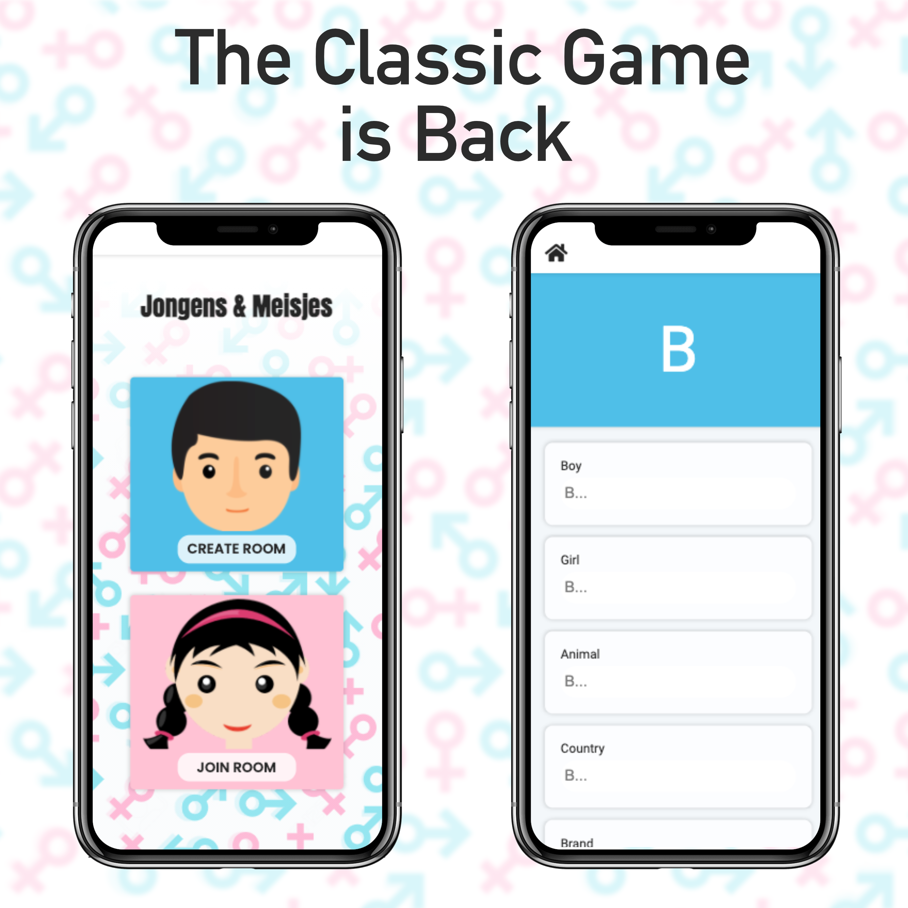
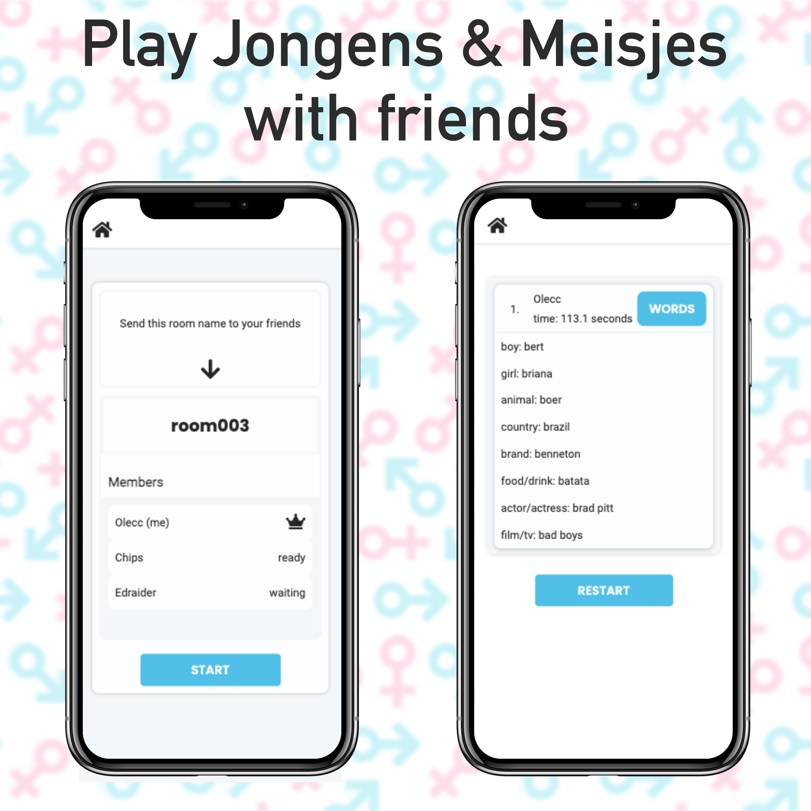

# Jongens & Meisjes
Translated 'Boys and Girls' is a traditional dutch game originally played with pen and paper

## Screenshot

## Technology Stack
This application was build using Svelte Vite and Firebase. The multiplayer feature was achieved using the firestore database realtime updates.

## Links 
The application can be found at: jongens-meisjes.web.app
